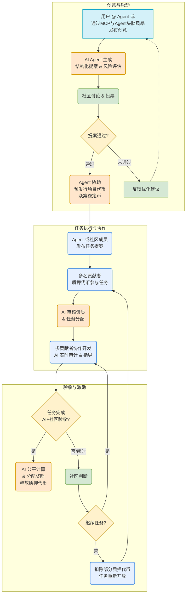

# Buidl Land

人与AI共创的乌托邦！

[Online PPT](https://deck-aptos.buidl.land/)

[Vedio](https://drive.google.com/drive/folders/1lWrlIhZkqs56Hmn_e1WfabuAy_3beQeC?usp=drive_link)

[Github](https://github.com/Buidl-Land/Buidl-Land)

## 1. 项目概述

我们不仅仅是在构建一个平台，我们是在**点燃一场革命**！Buidl Land 将成为一个**充满激情与创造力的数字城邦**，在这里，**人类的智慧与AI**将以前所未有的方式融合，共同孕育、打造真正**有价值、有意义、改变世界**的Web3项目和社区！

**告别冰冷的资本游戏，拥抱火热的共创时代！** 忘掉那些由少数VC主宰、缺乏灵魂的旧模式吧！在Buidl Land，我们坚信：

*   **每一个闪光的创意都值得被看见！** 无论你是谁，只要你有改变世界的想法，这里就是你的舞台。AI将助你将想法变为现实。
*   **每一次有效的贡献都必须被尊重！** 我们将用最公平、最透明的机制（由AI客观评估），确保你的才华和付出获得应有的、丰厚的回报。
*   **AI不再是冰冷的工具，而是并肩作战的伙伴！** AI将深度赋能项目的构思、孵化、开发、协作乃至社区治理的每一个环节，释放无限潜能，打破一切不可能！

**我们的核心使命：**

1.  **引爆创意核能**：打造一个**零门槛、高效率**的创意提交与孵化引擎。通过社交媒体@AI Agent即可提交创意，AI自动生成结构化提案（含技术路线/预算/里程碑），点燃众筹之火！
2.  **重塑协作范式**：建立一个**无需信任、贡献至上**的协作网络。通过动态质押（任务难度越高质押越多）与AI审计+社区投票，让能力成为唯一的通行证，完成任务即可解锁质押并获得奖励，让协作跨越地域与背景的鸿沟。
3.  **定义价值分配**：设计一套**公平公正、激励驱动**的代币经济体系。项目代币不仅用于奖励贡献（开发/运营/社区），也赋予持有者真实的治理权（投票、质押、竞选）。AI Agent将持有部分代币用于生态发展，确保长期价值。早期贡献者享有代币线性释放权益。
4.  **赋能社区自治**：构建一个**AI增强、社区主导**的治理框架。**DAO成员可以发起提案**，从项目决策、资金管理（AI+DAO共管）到人员招募、任务审核，让权力真正回归社区，由集体智慧引领未来方向，彻底摆脱VC的中心化控制。初期采用AI+社区委员会，逐步过渡到完全去中心化DAO。
5.  **融合社交力量**：利用Web3社交（SocialFi，如Farcaster/推特）的病毒式传播力，**点燃社区热情**，与用户深度互动，让共识凝聚，让影响力裂变，共同谱写Web3新篇章！

**加入我们，不仅仅是参与一个项目，更是共同开创一个属于创造者、贡献者和梦想家的Web3新纪元！** 让AI成为我们的翅膀，让社区成为我们的力量，一起Buidl，创造奇迹！

## 2. Buidl Land 工作原理

### 2.1 项目流程图

### 2.2 流程核心特点

-   **多元化创意来源**: 用户可通过 `@ Agent` 快速提交，或与 Agent 深度**头脑风暴并通过 MCP 发布**更成熟的创意。
-   **Agent 驱动众筹**: AI Agent 不仅评估创意，还**协助项目方预发行项目代币，以众筹所需的稳定币**，为项目启动注入燃料。
-   **任务提案双轨制**: **Agent 和社区成员均可发起任务提案**，促进项目发展，集思广益。
-   **协作式任务攻坚**: 单个任务提案可由**多位贡献者共同质押代币参与**，汇聚力量，加速完成。
-   **AI 公平奖励分配**: 任务完成后，**AI Agent 基于贡献数据进行客观、公平的奖励计算与分配**，并释放质押代币，确保贡献者获得应有回报。
-   **社区化风险处理**: 若任务在**限时内未完成，将由社区介入判断**，决定是继续推进还是重新开放任务，并可能根据情况**扣除部分质押代币**，形成闭环风险管理。
-   **持续优化闭环**: 平台通过 SocialFi 渠道（如 Farcaster、推特）与用户互动，收集反馈，持续优化 Agent 能力、治理模式和整体流程。

## 3. Buidl Land 项目能够解决的核心问题

Buidl Land代表了Web3项目发起、开发和治理方式的根本性突破：

1.  **痛点：Web3 泡沫与信任危机 (Rug Pull 频发，缺乏长期价值)**
    *   **传统困境：** 项目方"发币即走"，社区贡献者缺乏保障，投机取代建设。
    *   **Buidl Land 方案：** 以**动态质押**机制绑定长期责任；通过**AI+DAO共治**及**透明链上资金管理**，从根本上杜绝跑路风险；构建**可持续的价值创造**而非短期炒作。

2.  **痛点：创新被少数人垄断 (VC、技术、人脉壁垒高耸)**
    *   **传统困境：** 好创意因缺乏资源、技术背景或人脉而夭折；全球人才被地域和门槛限制。
    *   **Buidl Land 方案：** **零门槛社交化创意入口**，让任何人都能发声；**AI 辅助评估**，让创意凭价值胜出；**无需许可的任务贡献** (技能质押)，释放全球草根力量，实现彻底的**创新民主化**。

3.  **痛点：治理代币名存实亡 (缺乏真实效用，沦为投机工具)**
    *   **传统困境：** 大量治理代币仅有投票权甚至无实际用途，无法有效激励社区。
    *   **Buidl Land 方案：** 设计**强效用、多层次**的代币经济模型，赋予持有者**真实的治理权、参与权和经济收益权**；**AI 监督**确保分配公平，杜绝内部操纵，让代币成为**社区赋能和价值捕获**的核心引擎。

4.  **痛点：协作效率低下与信任成本高昂 (沟通不畅，协调困难)**
    *   **传统困境：** 去中心化协作往往伴随沟通障碍、信任摩擦和管理混乱。
    *   **Buidl Land 方案：** 以**智能合约和链上验证**构建**无需信任**的协作基础；**AI 全面赋能**项目管理、任务分配、进度审计、贡献评估和奖励结算，实现**高效、透明、自动化的人机协同**，极大降低协作成本。

## 4. 与不同平台和发币方法的对比

### 4.1 与 pumpfun 的比较
- **pumpfun**：快速上线的迷因币发行平台，注重短期炒作，实用性有限
- **Buidl Land 优势**：创新型项目的全生命周期管理，注重实际效用和可持续的社区驱动发展

### 4.2 与 daosfun 的比较
- **daosfun**：专注于迷因币投资的 DAO 管理，仍主要是投机性质且单一聚焦
- **Buidl Land 优势**：更广泛的项目类型支持，AI辅助质量控制，更深层次的社区参与结构

### 4.3 与传统 Web3 项目发行的比较
- **传统方式**：需要产品/MVP，治理可能集中化，进入门槛高
- **Buidl Land 优势**：
  - 去中心化治理，决策过程透明
  - 低进入门槛，支持创意阶段的项目
  - AI增强的项目管理效率
  - 动态质押机制防止开发停滞

## 5. 发展路线图

# Buidl Land 优化发展路线图

### 1. DAO治理基础建设
**重点工具开发：**
- 智能提案系统（AI辅助生成+结构化模板）
- 社区投票与决策机制
- 任务管理与贡献追踪框架

**实践应用：**
- 将Buidl Land项目本身作为首个DAO实践案例
- 建立内部治理流程验证工具可行性
- 收集早期用户反馈进行迭代优化

### 2. 贡献经济体系
**核心机制：**
- 多维度贡献评估系统
- 透明化奖励分配机制
- 动态激励机制设计

**社群协作：**
- 联合3-5个先锋Web3社群共同测试
- 开展跨社群贡献交换实验
- 建立联合治理案例库

### 3. Agent CEO能力建设
**功能开发：**
- 项目战略规划模块
- 资源协调与任务分配系统
- 社区沟通与决策支持

**实践验证：**
- 在Buidl Land项目中应用Agent治理
- 与合作伙伴社群进行Agent协同治理实验
- 建立Agent治理效果评估体系

### 4. 生态扩展与优化
**发展方向：**
- 治理工具标准化与模块化
- 跨社群治理协议
- 自适应治理模型

**社群网络：**
- 建立Buidl Land治理联盟
- 开展联合治理黑客松
- 形成最佳实践指南
